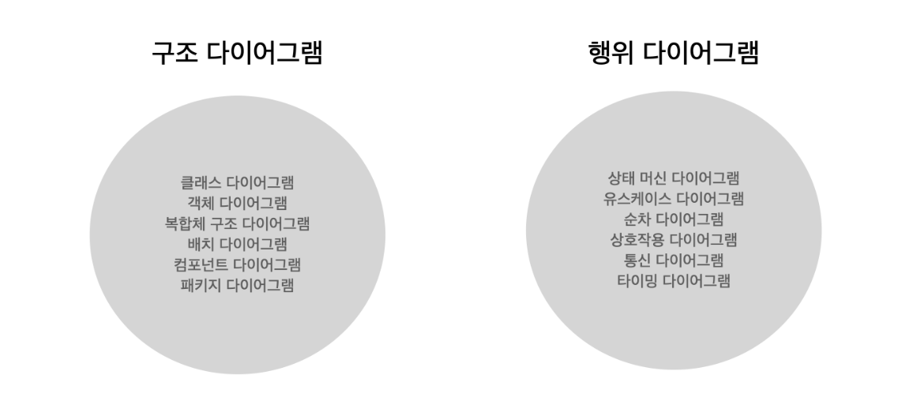

# 6장. 객체 지도

---

저자는 객체지향 설계를 지도를 이용하여 설명한다.

“지도를 제작한 사람들이 지도를 만들 때는 지도를 사용할 사람들이 구체적으로 어떤 목적으로 지도를 사용할지 알지 못한다.” (기능보단 구조를 우선시)

프로그램을 설계하다보면 구조를 고려하다가도 기능 지옥에 빠지곤 한다. 어떤 기능을 구현할 지 고민하다가 정신차려보면 구조가 뒤죽박죽 섞일 때가 많다.

그래서 위의 구문이 훅 하고 마음 속에 들어왔다.

이번 장은 책임-주도 설계의 본질인 **자주 변경되는 기능이 아니라 안정적인 구조를 따라 역할, 책임, 협력을 구성**하라는 내용을 다룬다.

## 기능 설계 vs 구조 설계

변경은 예측하는게 아니라 수용할 수 있는 선택의 여지를 마련해 놓는 것이다.

객체 구조를 바탕으로 시스템 기능을 객체 간의 책임으로 분배한다. 한번 더 말해보자 기능을 객체 간의 책임으로 분배한다.

즉, 구조에 집중하고 기능이 객체의 구조를 따르게 만든다.

## 도메인 모델링 : 구조 (stable)

- 도메인 : 사용자가 프로그램을 사용하는 대상 분야
- 모델 : 단순화해서 표현한 것. 지식을 선택적으로 단순화하고 의식적으로 구조화한 형태다.

→ 복잡한 건 싫어! 길을 잃지 않게 도와줘!!

표현적 차이 또는 의미적 차이를 줄이는 것은 

사용자가 도메인을 바라보는 관점을 그대로 코드에 반영한 것이고,

코드를 이해하기 쉽고, 객체지향적으로 설계할 수 있다.

## 유스케이스 : 기능 (unstable)

[특성]

1. 사용자와 시스템 간의 상호작용을 보여주는 ‘텍스트’다. 다이어그램이 아니다. 상호작용의 흐름에 초점을 두자.
2. 하나의 시나리오가 아니라 여러 시나리오들의 집합이다. (시나리오 == 유스케이스 인스턴스)
3. 단순한 feature 목록과 다르다. 
feature : 시스템이 수행해야하는 기능의 목록을 단순하게 나열한 것
여러 feature가 모여 시나리오가 된다.
4. 사용자 인터페이스와 관련된 세부 정보 포함 x → 사용자 관점에서 시스템의 행위에 초점을 맞춘다.
5. 내부 설계와 관련된 정보 포함 x

→정리하자면, 단지 사용자가 바라보는 시스템의 외부 관점만을 표현한다.

## 합체!

1. 시스템에 할당된 커다란 책임 → 시스템 안의 작은 규모의 객체들이 수행할 더 작은 규모의 책임으로 세분화
2. 그럼 어떤 객체를 선택할까? → 도메인 모델
3. 협력을 완성하는 데 필요한 메시지를 식별하면서 객체들에게 책임을 할당
4. 협력에 참여하는 객체를 구현하기 위해 클래스 추가, 속성, 메서드를 구현
5. 기능 완성!! 불안정한 기능을 수용할 수 있는 안정적인 구조가 되었다.

> 클래스 다이어그램 vs 도메인 모델
> 

> ~~그렇다면 최종 도메인 모델은 객체의 변수와 메서드를 간략히 정리해논 것인가?
’도메인 모델’을 검색해보면 책에서 처럼 도메인 모델을 설계한 글도 있고, 메서드까지 포함하여 설계한 글도 있다. 사실 구조를 잡는것에 집중하면 둘 다 뭐든 상관없다고 생각한다.
하지만 도메인 모델을 작성하라는 과제를 받았으면 어떻게 작성할 것인가?~~
> 

→ 클래스 다이어그램과 도메인 모델은 다르다. 도메인 모델은 개념적으로 접근하고, 클래스 다이어그램은 시스템의 구현을 설계하기 위한 것이다. 

# 7장. 함께 모으기

---

- 개념 관점 : 도메인 관점 - 개념
- 명세 관점 : 공용 인터페이스 - 인터페이스 (객체의 책임에 초점)
    - 협력안에서 메시지를 선택하고 수신할 객체를 선택하는 것 (5장 내용)
    - 구현과 인터페이스 분리
- 구현 관점 : 속성과 메서드 - 구현

- 커다란 시스템에 요청이 들어왔다. 이 요청을 처리하기 위한 시스템의 책임을 분할하여 협력을 통해 해결해보자.
- 협력을 위해 메시지를 고민한다. 이거 처리할 사람~~?
- 메시지를 처리하기위해 책임을 수행할 객체를 찾는다. 저요!!
- 해당 객체는 책임을 수행하는 도중에 스스로 할 수 없다면 Tell, Don’t Ask 한다.

→ 선택된 객체는 메시지를 자신의 인터페이스로 받아들인다.

→ 수신 가능한 메시지만 추려내면 객체의 인터페이스가 된다. (신기방기)

> 참고 - 설계와 구현
설계가 구현을 잡아먹어서는 안된다. 구현을 하다보면 구상한 설계는 대부분 변경된다. 따라서 최대한 빨리 코드를 구현해서 설계에 이상없는지 판단해야 한다.
코드를 구현하면서 설계에 대한 피드백을 날리도록 하자.
> 

> 참고 - 캡슐화 팁
객체가 어떤 책임을 수행해야 하는지를 결정한 후에, 책임을 수행하는 데 필요한 객체의 속성을 결정하라.
>
