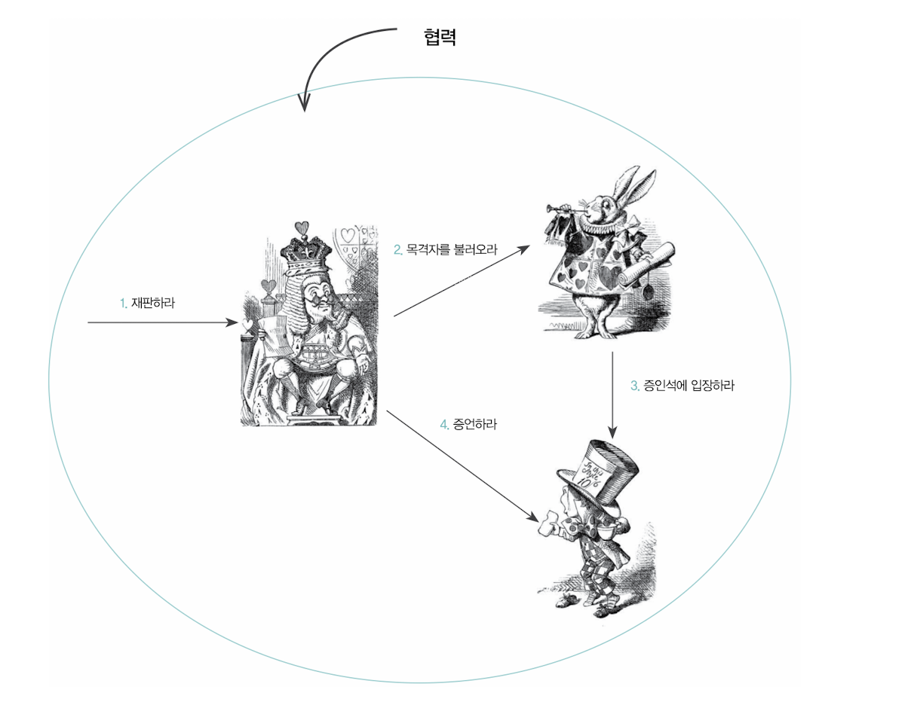

## 4장 역할, 책임, 협력

인간은 어떤 본질적인 특성을 지니고 있느냐가 아니라, 어떤 상황에 처해 있는지가 인간의 행동을 결정한다.

즉 개인이 처해 있는 문맥(context)이 행동을 결정한다.

- 여기서 문맥은 타인과의 `협력임`
- 객체의 세계에도 `협력`이라는 문맥이 객체의 `행동을 결정`함

→ 협력자를 무시하는 오만한 객체를 창조하지 말 것

요청과 응답은 협력에 참여하는 객체가 수행할 책임을 정의함

- 방식은 중요하지 않음

책임은 행위의 집합이다.

- 무엇을 알고 있는가 (knowing) → `아는 것`
- 무엇을 할 수 있는가 (doing) → `하는 것`

`메시지 전송`을 통해 객체가 다른 객체에게 주어진 `책임을 수행`하도록 요청한다.

→ 두 객체간의 협력은 메시지를 통해 이루어짐

→ 메시지는 협력을 위해 한 객체가 다른 객체로 접근할 수 있는 유일한 방법임

하나의 책임이 여러 메시지로 분할되는 것이 일반적이다.

> **객체지향 설계는 협력에 참여하기 위해 어떤 객체가 어떤 책임을 수행해야 하고, 어떤 객체로부터 메시지를 수신할 것인지를 결정하는 것으로부터 시작된다. p119**
>

객체지향 설계를 할 때, 협력과 책임의 관점에서 어떤 메시지를 받는지를 기준으로 설계하자 !

책임의 집합은 협력 안에서 수행하는 역할을 암시한다.

- 왜 객체에게 역할을 부여하는걸까?
- 이유는 바로 역할을 통해 `재사용` 가능하게 만듦

역할은 협력 내에서 다른 객체로 대체할 수 있음을 나타내는 표식이다.

- 유사한 협력을 `역할을 이용해 협력을 추상화`
- 그렇다면 어떤 객체가 역할을 대체할 수 있을까?
- 동일한 메시지(책임)를 이해할 수 있는 객체가 대체할 수 있음

> **객체가 역할에 주어진 책임 이외에 다른  책임을 수행할 수도 있다는 사실에 주목하라. `판사의 역할`을 수행할 수 있는 왕은 `재판을 할 책임`뿐만 아니라 `국정을 돌봐야 할 추가적인 책임`을 가지고 있다. p127**
>

객체의 타입과 역할 사이에는 일반화/특수화 관계가 성립하는 것이 일반적이다.

- 역할은 → 일반화
- 객체의 타입은 → 특수화

> **시스템에 필요한 데이터를 저장하기 위해 객체가 존재한다는 선입견을 가지고 있다. 물론 객체가 상태의 일부로 데이터를 포함하는 것은 사실이지만 데이터는 단지 객체가 행위를 수행하는 데 필요한 재료일 뿐이다. `객체가 존재하는 이유는 행위를 수행하며 협력에 참여하기 위해서다` 실제로 중요한 것은 객체의 행동, 즉 책임이다 p128**
>

이 구절을 보면서 객체의 존재 이유에 대해 다시 한번 생각해보는 계기가 됨

클래스는 단지 시스템에 필요한 객체를 표현하고 생성하기 위함이다.

- 클래스는 구현 메커니즘일 뿐
- 객체지향의 핵심은

→ `객체가 협력 안에서 어떤 책임과 역할을 수행할 것인지 결정` 하는 것 !

객체지향 설계 기법

- 책임-주도 설계 (R-DD)

→ 협력에 필요한 책임들 식별하고 객체에게 책임을 할당

→ 선 협력 후, 역할과 책임 → 객체 할당

- 디자인 패턴

→ 이미 누군가 해결하기 위해 만들어 놓은 것

→ 특정 상황에서 어떤 설계가 왜 더 효과적인지

- 테스트-주도 개발 (T-DD)

→ 실패하는 테스트를 작성하고, 테스트를 통과 시키는 코드, 리팩터링

→ TDD를 통해 응집도 높고 결합도가 낮은 클래스로 설계 가능

아직 TDD가 어려운걸 보니, 책임과 협력의 관점에서 객체를 바라보는 훈련이 부족한듯..!