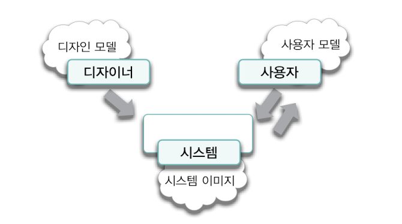

## 6장 객체 지도

기능이 아니라 `구조를 기반`으로 모델을 구축하자

- 범용적이고 이해하기 쉬움
- 자주 변경되는 기능이 아니라 안정적인 구조를 따라 역할,책임,협력을 구성하자

설계의 두 가지 측면

- 기능

→ 사용자를 위해 무엇을 할 수 있는지 초점

- 구조

→ 제품의 형태가 어떠해야 하는지 초점

⇒ 두 가지 측면을 조화롭게 사용

> 소프트웨어 분야에서 예외가 없는 유일한 규칙은 요구사항이 항상 변경된다는 것이다. p182
>

좋은 설계를 해야하는 이유라고 생각함 ~~개발자의 삶이 고단한 이유..~~

그렇다면 좋은 설계란 무엇일까?

- 요구사항 변경에 유연하게 대처할 수 있는 안정적인 구조
- 내가 생각하는 좋은 설계는 마감기한에 맞는 설계를 하는 것이다.
- 다양한 설계들을 저울질 하면서 창조하는 것.

기능을 수집하고 표현하기 위한 기법

- 유스케이스 모델링

구조를 수집하고 표현하기 위한 기법

- 도메인 모델링

도메인과 도메인 모델

- 도메인

→ 사용자가 프로그램을 사용하는 대상 분야

- 도메인 모델

→ 사용자들이 도메인을 바라보는 관점

→ 멘탈 모델 (= 자신이 상호작용하는 사물들에 대해 갖는 모형)

⇒ 사용자의 모델 == 디자인 모델이면 제일 이상적이지만, 최종 제품인 시스템 자체를 통해서만 의사소통 가능

유스케이스

- 사용자와 시스템 간의 상호작용을 `텍스트로` 표현한 것
- 하나의 시나리오가 아니라 여러 시나리오들의 집합이다.

→ 사용자의 목표와 관련된 모든 시나리오의 집합

- 단순한 피처 목록과는 다르다. ( 피처는 시스템이 수행해야 하는 기능의 목록 )

→ 독립적인 기능이 아님, 단순히 기능을 나열하는게 아닌 `상호작용`

- 사용자 인터페이스와 관련된 세부 정보를 포함하지 말아야 한다.
- 내부 설계와 관련된 정보를 포함하지 않는다.

→ 시스템 기능을 이야기 형식으로 나열하는 것이지, 내부 설계를 설명하는게 아님